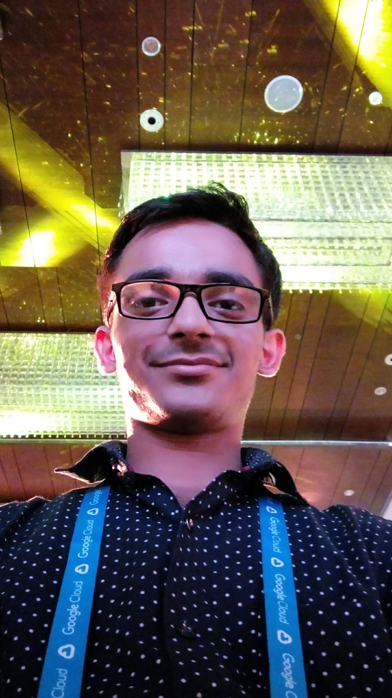
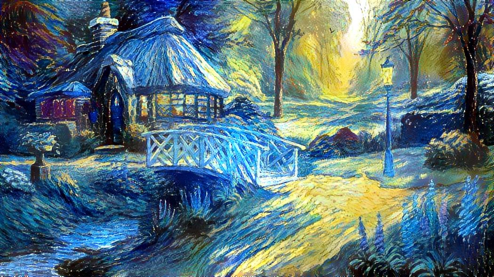
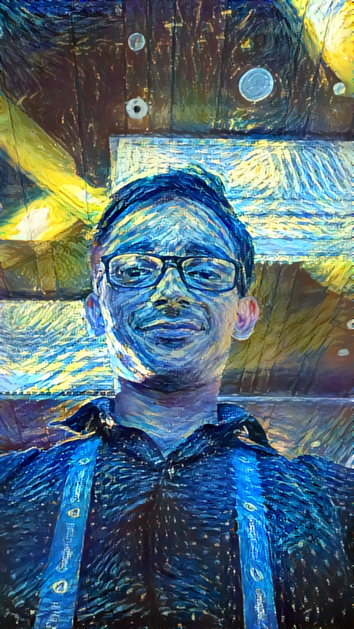

***Update:** Please check [udacity-nanodegree-projects](https://github.com/kHarshit/udacity-nanodegree-projects) repository!*

# Style Transfer in PyTorch

The jupyter notebook decribes the style transfer implementation of [Image Style Transfer Using Convolutional Neural Networks](https://www.cv-foundation.org/openaccess/content_cvpr_2016/papers/Gatys_Image_Style_Transfer_CVPR_2016_paper.pdf) by *Leon A. Gatys et al.*

The **Abstract** of the paper is:
> Rendering the semantic content of an image in different styles is a difficult image processing task. Arguably, a major limiting factor for previous approaches has been the lack of image representations that explicitly represent semantic information and, thus, allow to separate image content from style. Here we use image representations derived from Convolutional Neural Networks optimised for object recognition, which make high level image information explicit. We introduce
A **Neural Algorithm of Artistic Style** that can separate and recombine the image content and style of natural images. The algorithm allows us to produce new images of high perceptual quality that combine the content of an arbitrary photograph with the appearance of numerous well-known artworks. Our results provide new insights into the deep image representations learned by Convolutional Neural Networks and demonstrate their potential for high level image synthesis and manipulation.

You can read the **summary** of the above paper [here](https://github.com/aleju/papers/blob/master/neural-nets/A_Neural_Algorithm_for_Artistic_Style.md).

The jupyter notebook is from the **PyTorch Scholarship Challenge** from Udacity and facebook.

**NOTE:** If the notebook doesn't render here on GitHub, try it on [nbviewer](https://nbviewer.jupyter.org/github/kHarshit/style-transfer/blob/master/Style%20Transfer%20%28PyTorch%29.ipynb).

## Example

  content image            |  style image             | output image
:-------------------------:|:------------------------:|:-------------------------:
 |  | 
